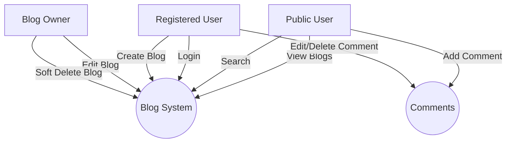
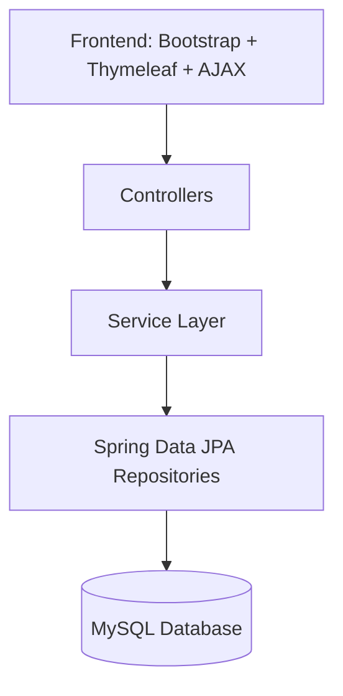
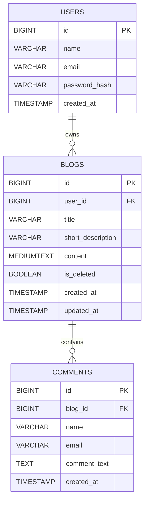
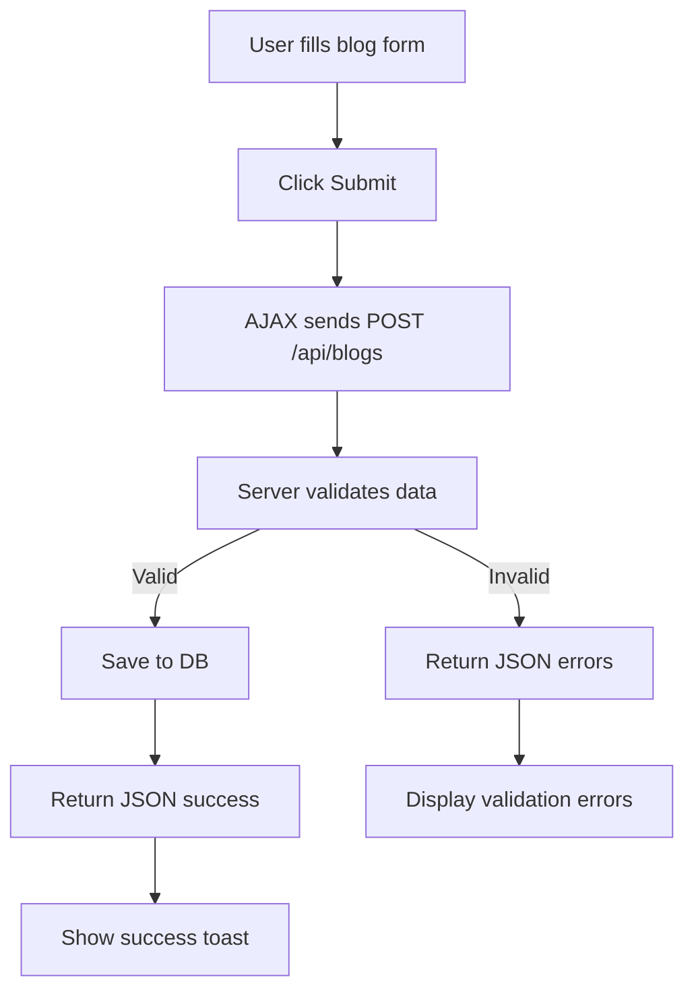

# 📌 Project Overview — Blog Web Application
A complete requirements specification for a Blog Application built using **Spring Boot MVC 3.5.8, Thymeleaf, MySQL, Spring Data JPA, Bootstrap, and AJAX**.  
The application supports user registration, login, blog creation (AJAX), editing, soft deletion, commenting (hard delete), public browsing, and search.
# 📘 Software Requirements Specification (SRS)

## 1. Introduction
### 1.1 Purpose  
This SRS defines all system behavior, architecture, data flow, UI/UX standards, and constraints for the Blog Web Application.

### 1.2 Intended Audience  
- Developers  
- QA Testers  
- Project Managers  
- Stakeholders  

### 1.3 Scope  
The system provides:  
- User authentication  
- Blog CRUD (soft delete)  
- Public browsing with search  
- User comments (hard delete)  

### 1.4 Definitions  
| Term | Meaning |
|------|---------|
| Soft Delete | Record not removed; marked deleted with flag |
| Hard Delete | Record permanently removed from DB |
| AJAX | Asynchronous JS requests without page reload |
# 📌 Functional Requirements

## 1. User Registration
- Users can register with name, email, password.
- Email must be unique.
- Password stored as BCrypt hash.

## 2. User Login
- Login using email + password.
- Maintain authenticated session.
- Redirect to dashboard.

## 3. Blog Management
### Create Blog (AJAX)
- Submit via AJAX request.
- Validate title + short_description uniqueness.
- Owner automatically assigned.
- Return JSON response.

### Edit Blog
- Only owner can edit.
- new updated_at timestamp required.

### Delete Blog
- Soft delete: set is_deleted = TRUE.
- Deleted blogs do not appear in:
  - Search
  - Public pages
  - User dashboard listings

## 4. Comments
- Any user can add a comment (no login required).
- Comments support edit/delete.
- Comments use **hard delete**.

## 5. Public Index Page
- All active (non-deleted) blogs visible.
- Search supported via:
  - title
  - short_description
  - FULLTEXT content search

# 📌 Non-Functional Requirements

## Performance
- Page load < 1.5 sec
- AJAX blog creation response < 300 ms

## Security
- BCrypt password hashing
- CSRF protection enabled
- Input sanitization
- SQL injection prevention using JPA

## Reliability
- 99% system uptime
- ACID-compliant transactions

## Usability
- Bootstrap responsive design
- Simple, minimal UI

## Compatibility
- Browsers: Chrome, Firefox, Edge, Safari

# 👤 User Roles & Permissions

| Feature | Public User | Registered User | Blog Owner |
|--------|-------------|------------------|------------|
| View Blogs | ✔ | ✔ | ✔ |
| Search Blogs | ✔ | ✔ | ✔ |
| Add Comment | ✔ | ✔ | ✔ |
| Edit Comment | ✔ (same email) | ✔ | ✔ |
| Delete Comment | ✔ (same email) | ✔ | ✔ |
| Create Blog | ✘ | ✔ | ✔ |
| Edit Blog | ✘ | ✘ | ✔ |
| Delete Blog | ✘ | ✘ | ✔ (soft delete) |






# 🗄 Database Design Explanation

## Users Table
- Stores account info.
- Email indexed for fast login.

## Blogs Table
- Soft delete implemented with `is_deleted`.
- FULLTEXT search on content.
- Unique title & short description.

## Comments Table
- Hard delete preferred due to small size.
- Email stored for commenter identification.

# 📦 Module-Level Design

## Modules
- **auth-module**  
  Handles login, registration, password hashing.

- **blog-module**  
  CRUD operations, AJAX handler, soft delete logic.

- **comment-module**  
  Comment creation, listing, edit/delete.

- **search-module**  
  MySQL fulltext search + filtering.

- **public-module**  
  Public homepage, list page, search results.

- **security-module**  
  Session, auth filter

```ascii
=========================================
 Public Home Page (Wireframe)
=========================================

+---------------------------------------------------------+
|  Blog Web App                                           |
+---------------------------------------------------------+
| Search: [ Enter text here ............ ] (Search Btn)   |
+---------------------------------------------------------+

+------------------------+-------------------------------+
|  Blog Title            |   Short Description           |
|  by John Doe           |   [Read More]                 |
+---------------------------------------------------------+

|  Blog Title 2          |   Short Description           |
|  by Jane Doe           |   [Read More]                 |
+---------------------------------------------------------+
```
# 🎨 UI/UX Guidelines

### Colors
- Primary: Bootstrap Primary (#0d6efd)
- Secondary: #6c757d
- Background: #f8f9fa

### Typography
- Font: Bootstrap default (Roboto / System font)

### Buttons
- Use `btn btn-primary` for main actions.
- Use `btn btn-warning` for edit.
- Use `btn btn-danger` for delete.

### Forms
- Always display validation below fields.
- Required fields marked with asterisks.

### Accessibility
- All buttons require aria-label.
- All inputs require `for` + `id` mapping.

# 🔌 API Endpoints List

## Authentication
| Method | URL | Description |
|--------|-----|-------------|
| POST | /register | Register |
| POST | /login | Login |

## Blogs
| Method | URL | Description |
|--------|-----|-------------|
| POST | /blogs | Create Blog (AJAX) |
| GET | /blogs/{id} | Get Blog |
| PUT | /blogs/{id}/edit | Edit Blog |
| DELETE | /blogs/{id}/delete | Soft Delete |

## Comments
| Method | URL | Description |
|--------|-----|-------------|
| POST | comments/{blogId} | Add Comment |
| PUT | /comments/{id}/edit | Edit Comment |
| DELETE | /comments/{id}/delete | Delete Comment (hard) |

## Search
| Method | URL | Description |
|--------|-----|-------------|
| GET | /search?q= | Search blogs |

```json
{
  "request": {
    "title": "My First Blog",
    "short_description": "Introduction blog",
    "content": "This is my first blog entry"
  },
  "response": {
    "status": "success",
    "blogId": 22,
    "message": "Blog created successfully"
  }
}
```
# 🛠 Validation Rules

## Registration
- name: required, min 2 chars
- email: required, email format, unique
- password: required, min 8 chars

## Blog
- title: required, max 200 chars, unique
- short_description: required, unique
- content: required

## Comment
- name: required
- email: required
- comment_text: required

# ❗ Error Handling Strategy

### 1. Client-side Validation
- Highlight invalid fields using Bootstrap `.is-invalid`.

### 2. Server-side Validation
Return JSON errors:

```json
{
 "status": "error",
 "errors": {
   "title": "Title already exists"
 }
}
```
### 3. Exception Handling (Global)
- 404 → Page Not Found

- 500 → General Error Page

---

# 🔎 Search Implementation Logic

## Search Fields
- Title (LIKE query)
- Short Description (LIKE query)
- Content (FULLTEXT search)

## Priority Ranking
1. Title exact match
2. Title partial match
3. Short description
4. Fulltext match score

## SQL Example

```sql
SELECT * FROM blogs 
WHERE is_deleted = FALSE 
  AND (
    title LIKE '%q%' 
    OR short_description LIKE '%q%' 
    OR MATCH(content) AGAINST ('q')
  )
```

# 🗑 Soft Delete Logic

## When Deleting a Blog
- Set `is_deleted = TRUE`.
- Exclude from:
  - Public index
  - User dashboard
  - Search results

## Restore?
- Not supported.

## Permanently Delete?
- Optional maintenance script:

```sql
DELETE FROM blogs WHERE is_deleted = TRUE AND updated_at < NOW() - INTERVAL 1 YEAR;
```
---


# 🚀 Future Enhancements

- Admin panel with moderation tools  
- Rich-text editor for blog content  
- Blog categories & tags  
- User profile pages  
- Image uploads (S3 or local storage)  
- Social media sharing  
- Pagination for blog list  
